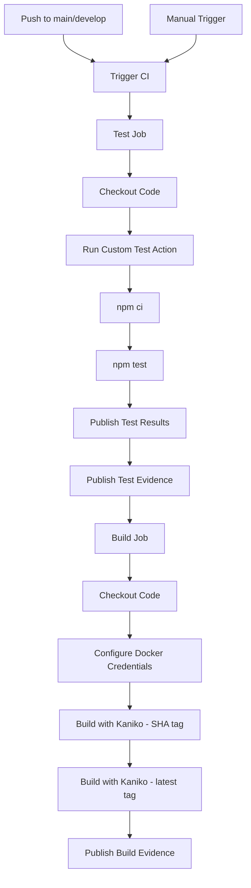

# Bookstore API

A RESTful API for managing a bookstore built with Node.js, Express, and deployed using CloudBees CI/CD.

## Features

- Full CRUD operations for books
- Health check endpoint
- Comprehensive test coverage (18+ tests)
- Docker containerization
- CloudBees CI/CD pipeline
- Automated testing and deployment

## API Endpoints

| Method | Endpoint | Description | Request Body |
|--------|----------|-------------|--------------|
| GET | `/health` | Health check | - |
| GET | `/books` | Get all books | - |
| GET | `/books/:id` | Get book by ID | - |
| POST | `/books` | Create new book | `{ title, author, genre?, price?, stock? }` |
| PUT | `/books/:id` | Update book | `{ title?, author?, genre?, price?, stock? }` |
| DELETE | `/books/:id` | Delete book | - |

### Book Schema

```json
{
  "id": "string (UUID)",
  "title": "string (required)",
  "author": "string (required)",
  "genre": "string (default: 'Unknown')",
  "price": "number (default: 0, must be >= 0)",
  "stock": "number (default: 0, must be >= 0)"
}
```

## Example Requests

### Get all books
```bash
curl http://localhost:3000/books
```

### Create a book
```bash
curl -X POST http://localhost:3000/books \
  -H "Content-Type: application/json" \
  -d '{
    "title": "The Hobbit",
    "author": "J.R.R. Tolkien",
    "genre": "Fantasy",
    "price": 15.99,
    "stock": 20
  }'
```

### Update a book
```bash
curl -X PUT http://localhost:3000/books/{id} \
  -H "Content-Type: application/json" \
  -d '{ "price": 12.99, "stock": 15 }'
```

### Delete a book
```bash
curl -X DELETE http://localhost:3000/books/{id}
```

## Local Development

### Prerequisites
- Node.js 18+
- npm

### Installation

```bash
# Install dependencies
npm install

# Run the server
npm start

# Run tests
npm test
```

The API will be available at `http://localhost:3000`

## Docker

### Build and run locally

```bash
# Build image
docker build -t bookstore-app .

# Run container
docker run -p 3000:3000 bookstore-app

# Test health endpoint
curl http://localhost:3000/health
```

## CloudBees CI/CD Workflow



### Workflow Components

1. **CI Workflow** (`.cloudbees/workflows/ci.yaml`)
   - Triggers: Push to main/develop, manual dispatch
   - Jobs: test, build
   - Evidence publishing

2. **Reusable Build Workflow** (`.cloudbees/workflows/build-image.yaml`)
   - Builds Docker images with Kaniko
   - Pushes to Docker Hub with SHA and latest tags
   - Configurable inputs

3. **Custom Test Action** (`.cloudbees/actions/test-node/action.yaml`)
   - Installs dependencies
   - Runs Jest tests
   - Publishes test results in JUnit format

### Setting Up CloudBees

1. **Configure Secrets** in CloudBees:
   - `DOCKER_USERNAME`: Your Docker Hub username
   - `DOCKER_PASSWORD`: Your Docker Hub password/token

2. **Create Component** in CloudBees pointing to this repository

3. **Workflow will automatically**:
   - Run on every push to main/develop
   - Can be triggered manually
   - Run tests and publish results
   - Build and push Docker images

## Test Coverage

The project includes 18 comprehensive tests covering:
- Health check endpoint
- GET all books and by ID
- POST validation (required fields, negative values)
- PUT validation
- DELETE operations
- 404 handling
- Edge cases

Run tests with coverage:
```bash
npm test
```

## Project Structure

```
bookstore-app/
├── .cloudbees/
│   ├── actions/
│   │   └── test-node/
│   │       └── action.yaml
│   └── workflows/
│       ├── ci.yaml
│       └── build-image.yaml
├── src/
│   └── index.js
├── tests/
│   └── books.test.js
├── .dockerignore
├── .gitignore
├── Dockerfile
├── package.json
└── README.md
```

## License

MIT
